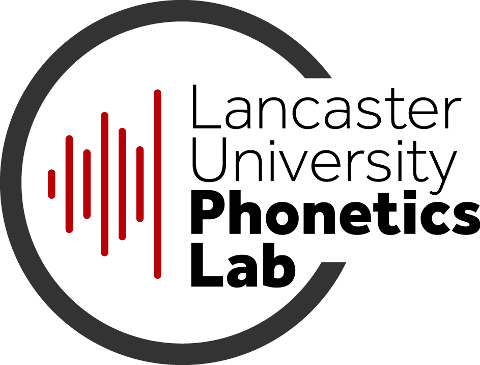

{:width="35%"}{:style="float:left; margin-right:30px; margin-top: 6px;"}

Lancaster University Phonetics Lab is research group spanning a series of interrelated research programs across phonetics and speech science. We are based in the [Department of Linguistics and English Language](https://www.lancaster.ac.uk/linguistics/) at [Lancaster University](https://www.lancaster.ac.uk). We are also affiliated with [Soundscape Voice Evidence](https://soundscapevoice.com), which is a private forensic speech science consultancy co-located in the department.

 

We pride ourselves on an inclusive, friendly and supportive research culture, where the purpose of the group is to provide an environment in which individuals can flourish and achieve their personal academic goals.

We specialise in the following research areas:

* Articulatory dynamics of speech (including methods for vocal tract imaging & kinematics)
* Laboratory phonology (including sociophonetics, sound change & dynamical modelling)
* Forensic speech science
* Speech technology
* Phonetics of minority languages & multilingualism

We also maintain active relations with a range of partners in the commercial, public and security sectors. Please feel free to browse this website to find out more about our lab's facilities, ongoing research, and opportunities within the group.